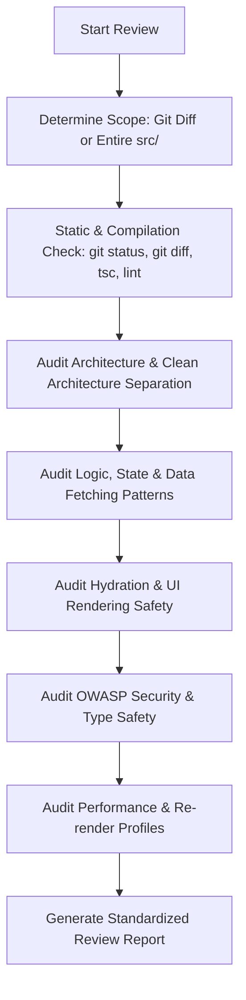

# OCOP Code Reviewer Skill

This skill provides a standardized workflow and rigorous criteria for automatically reviewing and evaluating source code quality in the OCOP project, ensuring all code meets production-ready standards before commit or merge.

---

## When to Use

- When the user requests a codebase review, commit review, or pull request/diff evaluation.
- When verifying compliance with Domain-Driven Design (DDD) and Clean Architecture in Next.js 16.
- When auditing security (OWASP Top 10, XSS, input sanitization), performance (re-render cycles, memoization, infinite scroll), and Hydration safety.
- When preparing for release or verifying the reliability of features in `src/features/`.

---

## Mandatory Standards Reference

All reviews must strictly align with the two foundational project governance documents:

1. [CODING_STANDARDS.md](file:///D:/OCOP-Project/full-stack/ocop/CODING_STANDARDS.md)
2. [AGENTS.md](file:///D:/OCOP-Project/full-stack/ocop/AGENTS.md)

### Core Architectural Rules:

1. **Layered Architecture (DDD & Clean Architecture):**
   - `src/app/` (Routing Layer): Houses routing logic and default Server Components only. Must NOT contain complex business logic.
   - `src/features/<domain>/` (Domain Core): All business logic must reside here, organized into:
     - `api/`: Axios API functions dedicated to this domain.
     - `hooks/`: Custom hooks using TanStack React Query (`useQuery`, `useMutation`) and domain logic.
     - `components/`: UI components internal to this domain.
     - `types/`: Domain-specific Zod schemas and TypeScript interfaces.
     - `utils/`: Internal helper/utility functions.
   - `src/components/` (Shared UI Layer): Contains only globally reusable "Dumb/Presentational Components" (AppButton, AppInput...). Must not contain API logic.
   - **View Components Rule:** UI Components (`.tsx`) must be "dumb", rendering only props and callbacks received from custom hooks. Never place `useForm`, `useQuery`, or `useMutation` directly inside View components unless it is an exceptionally simple, one-off component.

2. **State Management & Data Fetching:**
   - **100% Server State** managed via **TanStack React Query** (`@tanstack/react-query`). STRICTLY FORBIDDEN to use `useEffect + useState` or **RTK Query** for API data fetching.
   - **Redux Toolkit**: Reserved exclusively for Global UI State (Auth Session, Modal Open/Close, Theme).
   - **Standalone Hooks Principle:** NEVER define `useQuery` or `useMutation` inside another function or hook (Hook-Inside-Hook anti-pattern) to prevent `QueryObserver` memory leaks.

3. **Centralized API Error Handling:**
   - Global interceptor at `src/lib/axios.ts` automatically catches errors, emits toast notifications, and parses `AppError`.
   - **Prohibited:** Do not write `try-catch` blocks in `api/` or inside `mutationFn` solely to rethrow errors (`throw err`). Use `try-catch` only when implementing specific fallback logic.
   - Standard API success code: `resData.code === 1000`.

4. **Type Safety & Zod Validation:**
   - 100% TypeScript; usage of `any` is strictly prohibited.
   - All mutation request payloads and critical API responses must be validated with Zod schemas.

5. **Hydration Error Prevention (Next.js App Router):**
   - Apply the `isMounted` pattern for Client Components using browser APIs (`window`, `localStorage`) or non-deterministic rendering (dates, carousels).
   - Never use `typeof window !== 'undefined'` directly inside JSX return blocks.
   - Adhere strictly to valid HTML nesting rules (no `div` inside `p`, no `a` inside `a`).

6. **Standardized Infinite Scroll:**
   - Mandatory usage of `useInfiniteQuery`.
   - Attach the `X-Silent-Loading: true` header when executing `fetchNextPage` to prevent flashing the global `LoadingOverlay`.

---

## Automated Review Workflow



### Step 1: Scope Detection

1. Run `git status -s` and `git diff --stat` (or `git diff HEAD~1` if already committed) to inspect modified files.
2. If changes exist: Conduct a targeted deep review of impacted files and associated domain modules.
3. If no pending changes or when a full audit is requested: Audit key modules across `src/features/` and `src/app/`.

### Step 2: Compilation & Linter Verification

- Run `npx tsc --noEmit` and execute ESLint checks.
- Verify that there are zero type errors and zero hidden `any` types.

### Step 3: Detailed Checklist Inspection

Audit each file against the verification checklist:

- [ ] Is any UI component "fat" (containing queries, mutations, or complex forms directly)?
- [ ] Are any hooks violating the Standalone Hooks principle (hook-inside-hook)?
- [ ] Are there redundant `try-catch` blocks in `api/` or `mutationFn`?
- [ ] Is there risk of Hydration mismatch (SSR execution of `window`, `Date.now()`)?
- [ ] Do forms implement complete Zod schemas and validation resolvers?
- [ ] Are static arrays and objects outside components hoisted or wrapped in `useMemo`?
- [ ] Are there security vulnerabilities: Hardcoded secrets, missing sanitization, XSS vectors?

---

## Standardized Review Report Format

Upon completing a review, structure the findings following this template:

```markdown
# Code Review Report: [Module / Feature Name]

## 1. Executive Verdict

- **Overall Assessment:** 🟢 [PASS] / 🟡 [WARN - Minor Revisions Needed] / 🔴 [FAIL - Block Merge]
- **Issue Count:** `X` Critical | `Y` High | `Z` Medium | `W` Suggestion

## 2. Critical & High Issues

_Crashes, hydration mismatches, core architectural violations, security vulnerabilities._

- **[Issue Title]** at `[filename.tsx](file:///absolute/path#L10-L25)`:
  - **Description:** [Issue details and system impact]
  - **Standard Violated:** [Rule reference in CODING_STANDARDS.md or AGENTS.md]
  - **Remediation:**
    \`\`\`tsx
    // ❌ Anti-pattern (Before):
    ...

// ✅ Recommended (After):
...
\`\`\`

## 3. Improvements & Optimizations (Medium & Low)

_Re-render efficiency, static hoisting, typing precision, clean code._

- [List of actionable recommendations with file links]

## 4. Strengths & Commendations

- [Notable positive patterns: Clean architecture, strict hook separation, solid typing...]
```
